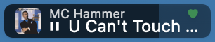

# Hammertunes.spoon

<p align="center">
  <br>
  <em>Stop! Hammertunes.</em>
</p>

A menubar **pill** for [Hammerspoon](https://www.hammerspoon.org/) that shows
what's playing and lets you control it - artwork, a live progress bar,
press-and-hold scrubbing, click-zone transport, and a rich right-click menu.

It works with **Spotify** or **Apple Music** (beta - basics tested). Most
people use one or the other, so the setup below is split into two
self-contained guides - **jump straight to [Spotify](#-spotify) or
[Apple Music](#-apple-music-beta)** and follow only that one.

<p align="center">
  <br>
  <em>The pill in the menubar - right-click for playback controls, shuffle, like, and playlists.</em>
</p>

## What it does (either backend)

- **Now-playing pill** with album (or playlist) cover art, song/artist, and a
  progress bar that doubles as the menubar item.
- **Everything is on the pill** - click different parts of it to control
  playback, or right-click for the full menu. See **[Controls](#controls)**.
- **Right-click menu** for shuffle, like/favorite, playlists, and settings. The
  exact items differ per backend - see each guide below.

---

## Controls

There are no keyboard shortcuts to memorize - the pill **is** the control. You
click different parts of it, or right-click for the full menu.

### The pill



- **Cover art** on the left, the **artist** on the top line, the **play icon +
  song title** below (**⏸** playing / **▶** paused).
- The pill's **background is a progress bar** - it fills left → right as the song
  plays.
- A **♥** marks a liked/favorite track (Spotify green / Apple Music red).
- When nothing is playing the pill collapses to a single **♪**, and any click
  just opens a small menu (open the app / switch backend).

### Click zones

Click a different third of the pill for each transport action:

```
   [    ◀ Prev    |    ⏸ Play / Pause    |    Next ▶    ]
        left              center               right
                    (double-click = copy)
```

| Gesture | Where on the pill | What it does |
| --- | --- | --- |
| **Click** | Left | **Previous** track - or **restart** the current one if you're more than ~3s in |
| **Click** | Center | **Play / Pause** |
| **Double-click** | Center | **Copy** "Song by Artist" to the clipboard |
| **Click** | Right | **Next** track |
| **Long-click** (press and hold ~1s) | Anywhere | **Seek** the playhead to the spot under your cursor - no drag needed |
| **Hold, then drag** | Anywhere | **Scrub** - keep dragging after the hold to move the playhead in real time |
| **⌘-drag** | Anywhere | **Move** the pill to a different spot in the menubar (standard macOS gesture) |
| **Right-click** | Anywhere | Open the **[right-click menu](#right-click-menu)** |

### Right-click menu

Right-click the pill for everything else. Items are grouped top to bottom, and a
few differ by backend - the full per-backend lists are under
[Spotify](#right-click-menu-spotify) and
[Apple Music](#right-click-menu-apple-music).

- **Transport** - **Previous / Play-Pause / Next**, each labelled with its click
  zone so you learn the shortcuts, plus **Seek to `M:SS`**: jump the playhead to
  the exact spot you right-clicked on the pill.
- **This track** - **Like/Favorite**, **Copy "Song by Artist"**,
  **Open on YouTube**, **Add to Playlist**.
- **Play something** - **Shuffle**, **Play Playlist**, **Play Liked Songs**
  (Spotify), **Show Other Sources** (Apple Music).
- **Settings** - **Refresh interval** (how often the pill checks the player:
  1 / 2 / 3 / 5 / 10s; **3s** default, shorter is snappier but uses more battery,
  so short options are flagged ⚠), **Re-authenticate** / first-time setup,
  **Update available** (git installs), and **Switch backend**.

---

## 🟢 Spotify

> **Read this section if you use Spotify.** It's everything you need, start to
> finish. (Apple Music users: skip to [Apple Music](#-apple-music-beta).)

### Requirements

- macOS + Hammerspoon
- The **Spotify desktop app** (transport and now-playing go through it).

> **The Spotify developer app is optional.** Out of the box you get the
> now-playing pill, transport, scrubbing, copy, and local shuffle - no account
> setup, no login. Set up a free developer app (step 3) only if you want the
> **Web API extras**: playlists (Add to / Play Playlist), like/unlike, Play
> Liked Songs, the playing-context name in the tooltip, and the Smart Shuffle
> indicator.

### 1. Install

With Homebrew:

```sh
brew install --cask tokenmaxxr/tap/hammertunes
```

Or with git - it's a plain Spoon directory, no zip needed:

```sh
git clone https://github.com/tokenmaxxr/Hammertunes.spoon \
  ~/.hammerspoon/Spoons/Hammertunes.spoon
```

Update later with `brew upgrade --cask hammertunes` or
`git -C ~/.hammerspoon/Spoons/Hammertunes.spoon pull` (or
`make -C ~/.hammerspoon/Spoons/Hammertunes.spoon update`). Git installs also
check for updates on launch and offer an **"Update available"** item in the
right-click menu when there is one (it never installs without that click); to
disable the check, set `spoon.Hammertunes.checkForUpdates = false` before
`:start()`.

### 2. Add to your `~/.hammerspoon/init.lua`

```lua
hs.loadSpoon("Hammertunes")
spoon.Hammertunes:start()   -- Spotify is the default backend
```

That's the whole basic setup: the pill, transport, scrub, copy, and local
shuffle. If you don't want the Web API extras, you're done.

### 3. (Optional) Enable the Web API extras

For playlists, like/unlike, Play Liked Songs, the playing-from name, and the
Smart Shuffle indicator, open the pill's **right-click menu** and choose
**"Enable Spotify extras…"**. It walks you through creating a free Spotify API
key and approving access in your browser - no `init.lua` editing. The first time
you run unauthenticated, the pill also offers this once.

<details>
<summary>Prefer to set it up by hand?</summary>

1. Go to <https://developer.spotify.com/dashboard> → **Create app**.
2. Set the **Redirect URI** to exactly `http://127.0.0.1:53127/callback`.
3. Copy the app's **Client ID**, then authenticate once (opens a browser):

```lua
hs.loadSpoon("Hammertunes")
spoon.Hammertunes:authenticate("YOUR_SPOTIFY_CLIENT_ID")  -- one time
spoon.Hammertunes:start()
```

The login is saved to the macOS Keychain, so later launches need only `:start()`.
</details>

### Right-click menu (Spotify)

The transport, seek, copy, shuffle, refresh-interval, and switch items work out
of the box. The **like**, **Add to Playlist**, **Play Playlist**, and **Play
Liked Songs** items need the optional Web API setup from step 3.

- **Previous / Play-Pause / Next / Seek to `M:SS`** - transport, mirroring the
  [click zones](#click-zones).
- **Shuffle:** Off / Shuffle, plus a read-only **Smart Shuffle** state (Spotify
  owns Smart Shuffle; the pill can show it but not toggle it).
- **Like / Unlike** the current track.
- **Copy "Song by Artist"** and **Open on YouTube** for the current track.
- **Add to Playlist** - playlists you own, with cover thumbnails.
- **Play Playlist** - your library with cover thumbnails; recently-played
  playlists are pinned on top (the only way Discover Weekly / Release Radar show
  up without following them).
- **Play Liked Songs.**
- **Refresh interval** - how often the pill polls the player (1 / 2 / 3 / 5 / 10s;
  3s default, shorter = more battery).
- **Re-authenticate** (if the token ever needs refreshing).
- **Switch to Apple Music** - see [Switching backends](#switching-backends).

---

## 🔴 Apple Music (beta)

> ⚠️ **Beta.** The basics have been tested.
> [Report issues](https://github.com/tokenmaxxr/Hammertunes.spoon/issues) if you hit any.
>
> **Read this section if you use Apple Music.** It's everything you need, start
> to finish. No account, developer app, or login required.

### Requirements

- macOS + Hammerspoon
- The **Music app** (transport and now-playing go through it).
- An Apple Music subscription is only needed to stream catalog tracks; the pill
  works just as well with music already in your library (purchased or imported).
  **The spoon itself needs no setup, developer app, or authentication.**

### 1. Install

With Homebrew:

```sh
brew install --cask tokenmaxxr/tap/hammertunes
```

Or with git - it's a plain Spoon directory, no zip needed:

```sh
git clone https://github.com/tokenmaxxr/Hammertunes.spoon \
  ~/.hammerspoon/Spoons/Hammertunes.spoon
```

Update later with `brew upgrade --cask hammertunes` or
`git -C ~/.hammerspoon/Spoons/Hammertunes.spoon pull` (or
`make -C ~/.hammerspoon/Spoons/Hammertunes.spoon update`). Git installs also
check for updates on launch and offer an **"Update available"** item in the
right-click menu when there is one (it never installs without that click); to
disable the check, set `spoon.Hammertunes.checkForUpdates = false` before
`:start()`.

### 2. Add to your `~/.hammerspoon/init.lua`

```lua
hs.loadSpoon("Hammertunes")
spoon.Hammertunes:start({ backend = "applemusic" })
```

That's it - no auth step. (Equivalent: `spoon.Hammertunes:setBackend("applemusic"):start()`.)

### Right-click menu (Apple Music)

- **Previous / Play-Pause / Next / Seek to `M:SS`** - transport, mirroring the
  [click zones](#click-zones).
- **Shuffle:** Off / Shuffle (Apple Music has no Smart Shuffle).
- **Favorite / Unfavorite** the current track.
- **Copy "Song by Artist"** and **Open on YouTube** for the current track.
- **Add to Playlist** - your library playlists.
- **Play Playlist** - your library playlists (no cover thumbnails).
- **Show Other Sources** - mirror Now Playing from browsers and other apps
  (MediaRemote is system-wide); off by default, and Spotify is always excluded.
- **Refresh interval** - how often the pill polls the player (1 / 2 / 3 / 5 / 10s;
  3s default, shorter = more battery).
- **Switch to Spotify** - see [Switching backends](#switching-backends).

### Streaming vs. library tracks

For tracks **in your library**, you get full now-playing plus artwork, favorite,
and add-to-playlist. For **streaming catalog tracks not added to your library**,
macOS Tahoe's Music scripting can't read the current track, so the pill falls
back to the private **MediaRemote** framework for title / artist / progress
(artwork is usually absent, and the library-only actions - favorite,
add-to-playlist - are hidden because they can't succeed). Transport and Play
Playlist work either way.

---

## Switching backends

You don't have to commit in `init.lua`. Open the pill's **right-click menu** and
choose **"Switch to Spotify" / "Switch to Apple Music"**. That choice is saved
and **takes precedence** over `:setBackend()` / `opts.backend` on later launches,
so you can leave your config as-is and toggle from the menu whenever you like.

## Status

- ✅ **Spotify** - transport, state, playlists, like, recently-played, shuffle.
- ⚠️ **Apple Music (beta)** - transport, now-playing, artwork
  and favorite for library tracks, library playlists, and a MediaRemote fallback
  for streaming tracks on macOS Tahoe. Basics tested, but not used day to day, so
  longer use may surface rough edges.

## Development

For hacking on the Spoon itself, clone to a directory **without** the `.spoon`
extension and symlink it into place - Hammerspoon claims the `.spoon` extension,
so double-clicking a `.spoon` folder in Finder "installs" it by moving it into
`~/.hammerspoon/Spoons/` (taking your checkout with it):

```sh
git clone https://github.com/tokenmaxxr/Hammertunes.spoon ~/git/Hammertunes
ln -s ~/git/Hammertunes ~/.hammerspoon/Spoons/Hammertunes.spoon
```

Pure logic (state parsing, progress math, AppleScript escaping) has a small
unit-test suite that runs without Hammerspoon:

```sh
make test   # luac -p syntax check + unit tests (needs `lua` on PATH)
```

## License

MIT - see [LICENSE](LICENSE).
