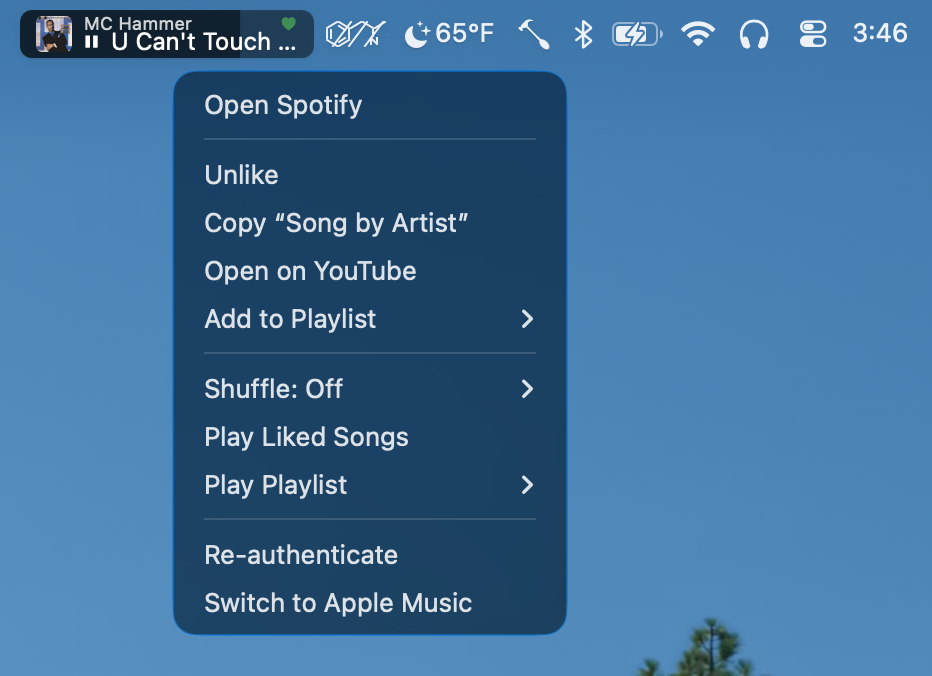

# Hammertunes.spoon

<p align="center">
  <br>
  <em>Stop! Hammertunes.</em>
</p>

A menubar **pill** for [Hammerspoon](https://www.hammerspoon.org/) that shows
what's playing and lets you control it - artwork, a live progress bar,
press-and-hold scrubbing, click-zone transport, and a rich right-click menu.

It works with **Spotify** or **Apple Music** (alpha - not tested yet). Most
people use one or the other, so the setup below is split into two
self-contained guides - **jump straight to [Spotify](#-spotify) or
[Apple Music](#-apple-music-alpha)** and follow only that one.

<p align="center">
  <br>
  <em>The pill in the menubar - right-click for playback controls, shuffle, like, and playlists.</em>
</p>

## What it does (either backend)

- **Now-playing pill** with album (or playlist) cover art, song/artist, and a
  progress bar that doubles as the menubar item.
- **Click zones:** left = previous/restart, middle = play/pause, right = next.
- **Press-and-hold to scrub** to a position; drag to seek.
- **Double-click** the middle to copy "Song by Artist".
- **Right-click menu** for shuffle, like/favorite, and playlists. The exact
  items differ per backend - see each guide below.

---

## 🟢 Spotify

> **Read this section if you use Spotify.** It's everything you need, start to
> finish. (Apple Music users: skip to [Apple Music](#-apple-music-alpha).)

### Requirements

- macOS + Hammerspoon
- The **Spotify desktop app** (transport and now-playing go through it).

> **The Spotify developer app is optional.** Out of the box you get the
> now-playing pill, transport, scrubbing, copy, and local shuffle - no account
> setup, no login. Set up a free developer app (step 3) only if you want the
> **Web API extras**: playlists (Add to / Play Playlist), like/unlike, Play
> Liked Songs, the playing-context name in the tooltip, and the Smart Shuffle
> indicator.

### 1. Install

With Homebrew:

```sh
brew install --cask tokenmaxxr/tap/hammertunes
```

Or with git - it's a plain Spoon directory, no zip needed:

```sh
git clone https://github.com/tokenmaxxr/Hammertunes.spoon \
  ~/.hammerspoon/Spoons/Hammertunes.spoon
```

Update later with `brew upgrade --cask hammertunes` or
`git -C ~/.hammerspoon/Spoons/Hammertunes.spoon pull` (or
`make -C ~/.hammerspoon/Spoons/Hammertunes.spoon update`). Git installs also
check for updates on launch and offer an **"Update available"** item in the
right-click menu when there is one (it never installs without that click); to
disable the check, set `spoon.Hammertunes.checkForUpdates = false` before
`:start()`.

### 2. Add to your `~/.hammerspoon/init.lua`

```lua
hs.loadSpoon("Hammertunes")
spoon.Hammertunes:start()   -- Spotify is the default backend
```

That's the whole basic setup: the pill, transport, scrub, copy, and local
shuffle. If you don't want the Web API extras, you're done.

### 3. (Optional) Enable the Web API extras

For playlists, like/unlike, Play Liked Songs, the playing-from name, and the
Smart Shuffle indicator, open the pill's **right-click menu** and choose
**"Enable Spotify extras…"**. It walks you through creating a free Spotify API
key and approving access in your browser - no `init.lua` editing. The first time
you run unauthenticated, the pill also offers this once.

<details>
<summary>Prefer to set it up by hand?</summary>

1. Go to <https://developer.spotify.com/dashboard> → **Create app**.
2. Set the **Redirect URI** to exactly `http://127.0.0.1:53127/callback`.
3. Copy the app's **Client ID**, then authenticate once (opens a browser):

```lua
hs.loadSpoon("Hammertunes")
spoon.Hammertunes:authenticate("YOUR_SPOTIFY_CLIENT_ID")  -- one time
spoon.Hammertunes:start()
```

The login is saved to the macOS Keychain, so later launches need only `:start()`.
</details>

### Right-click menu (Spotify)

Everything except local shuffle and the backend switch needs the optional Web
API setup from step 3.

- **Shuffle:** Off / Shuffle, plus a read-only **Smart Shuffle** state (Spotify
  owns Smart Shuffle; the pill can show it but not toggle it).
- **Like / Unlike** the current track.
- **Copy "Song by Artist"** and **Open on YouTube** for the current track.
- **Add to Playlist** - playlists you own, with cover thumbnails.
- **Play Playlist** - your library with cover thumbnails; recently-played
  playlists are pinned on top (the only way Discover Weekly / Release Radar show
  up without following them).
- **Play Liked Songs.**
- **Re-authenticate** (if the token ever needs refreshing).
- **Switch to Apple Music** - see [Switching backends](#switching-backends).

---

## 🔴 Apple Music (alpha)

> ⚠️ **Alpha - not tested yet.** The Apple Music backend is implemented but
> hasn't been exercised against a real library; expect rough edges and please
> [report issues](https://github.com/tokenmaxxr/Hammertunes.spoon/issues).
>
> **Read this section if you use Apple Music.** It's everything you need, start
> to finish. No account, developer app, or login required.

### Requirements

- macOS + Hammerspoon
- The **Music app** (transport and now-playing go through it).
- An Apple Music subscription is only needed to stream catalog tracks; the pill
  works just as well with music already in your library (purchased or imported).
  **The spoon itself needs no setup, developer app, or authentication.**

### 1. Install

With Homebrew:

```sh
brew install --cask tokenmaxxr/tap/hammertunes
```

Or with git - it's a plain Spoon directory, no zip needed:

```sh
git clone https://github.com/tokenmaxxr/Hammertunes.spoon \
  ~/.hammerspoon/Spoons/Hammertunes.spoon
```

Update later with `brew upgrade --cask hammertunes` or
`git -C ~/.hammerspoon/Spoons/Hammertunes.spoon pull` (or
`make -C ~/.hammerspoon/Spoons/Hammertunes.spoon update`). Git installs also
check for updates on launch and offer an **"Update available"** item in the
right-click menu when there is one (it never installs without that click); to
disable the check, set `spoon.Hammertunes.checkForUpdates = false` before
`:start()`.

### 2. Add to your `~/.hammerspoon/init.lua`

```lua
hs.loadSpoon("Hammertunes")
spoon.Hammertunes:start({ backend = "applemusic" })
```

That's it - no auth step. (Equivalent: `spoon.Hammertunes:setBackend("applemusic"):start()`.)

### Right-click menu (Apple Music)

- **Shuffle:** Off / Shuffle (Apple Music has no Smart Shuffle).
- **Favorite / Unfavorite** the current track.
- **Copy "Song by Artist"** and **Open on YouTube** for the current track.
- **Add to Playlist** - your library playlists.
- **Play Playlist** - your library playlists (no cover thumbnails).
- **Switch to Spotify** - see [Switching backends](#switching-backends).

### Streaming vs. library tracks

For tracks **in your library**, you get full now-playing plus artwork, favorite,
and add-to-playlist. For **streaming catalog tracks not added to your library**,
macOS Tahoe's Music scripting can't read the current track, so the pill falls
back to the private **MediaRemote** framework for title / artist / progress
(artwork is usually absent, and the library-only actions - favorite,
add-to-playlist - are hidden because they can't succeed). Transport and Play
Playlist work either way.

---

## Switching backends

You don't have to commit in `init.lua`. Open the pill's **right-click menu** and
choose **"Switch to Spotify" / "Switch to Apple Music"**. That choice is saved
and **takes precedence** over `:setBackend()` / `opts.backend` on later launches,
so you can leave your config as-is and toggle from the menu whenever you like.

## Status

- ✅ **Spotify** - transport, state, playlists, like, recently-played, shuffle.
- ⚠️ **Apple Music (alpha, not tested yet)** - transport, now-playing, artwork
  and favorite for library tracks, library playlists, and a MediaRemote fallback
  for streaming tracks on macOS Tahoe. Implemented but not yet exercised against
  a real library.

## Development

Pure logic (state parsing, progress math, AppleScript escaping) has a small
unit-test suite that runs without Hammerspoon:

```sh
make test   # luac -p syntax check + unit tests (needs `lua` on PATH)
```

## License

MIT - see [LICENSE](LICENSE).
